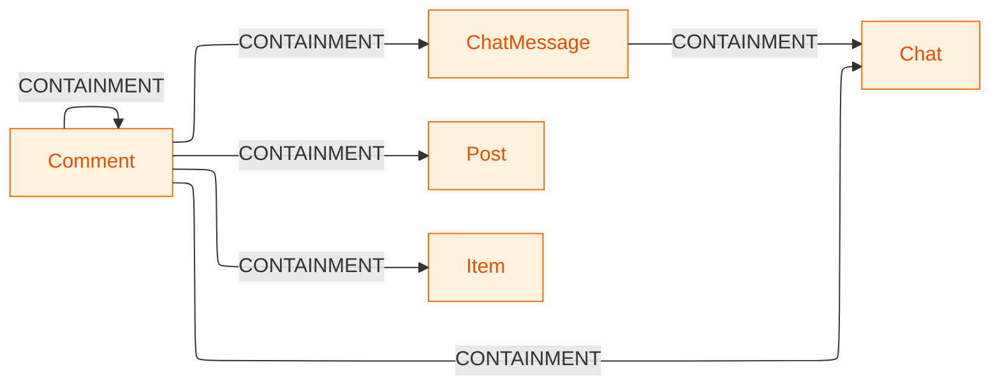
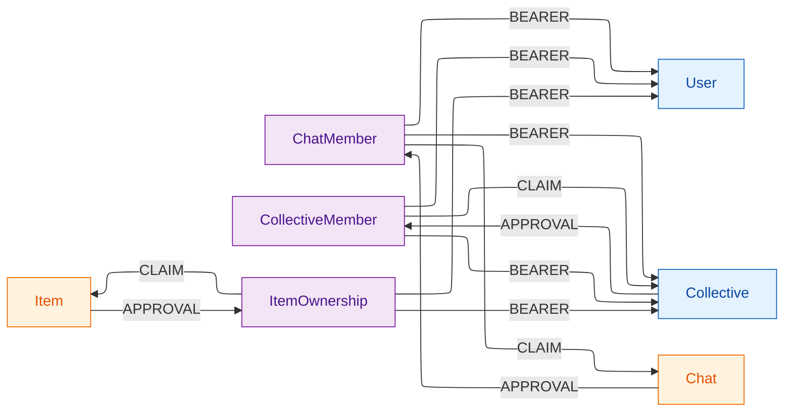
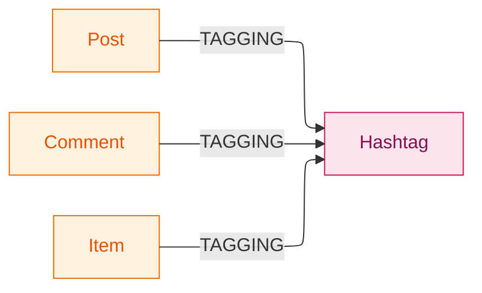
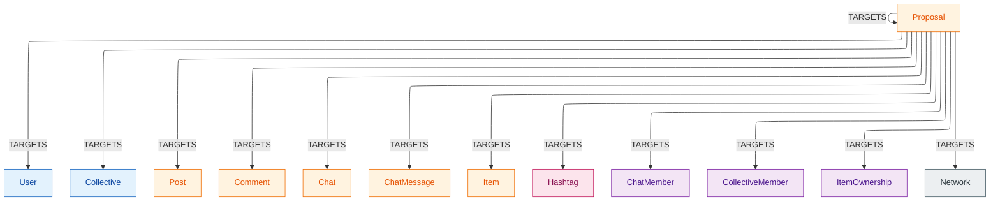
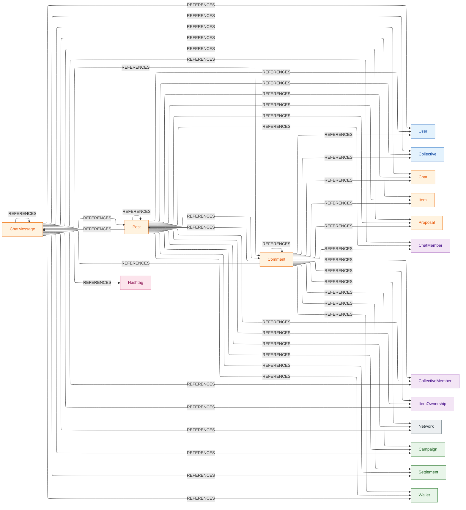
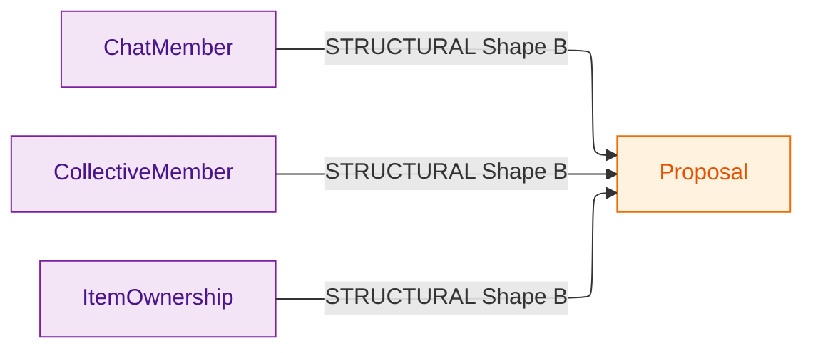
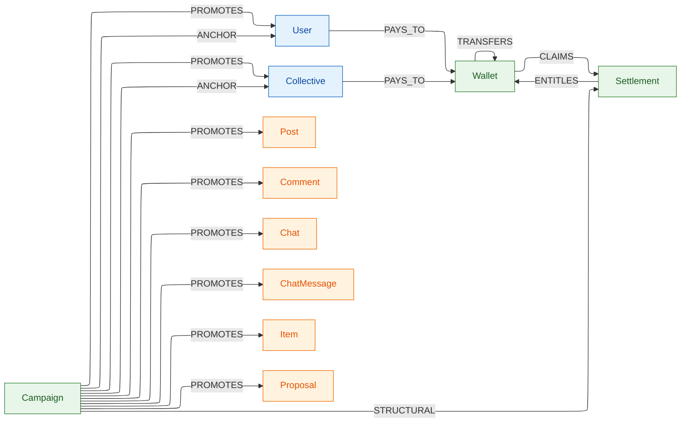

# Structural Edge Map

A visual reference for every structural edge in the CoGra graph,
plus an audit of `(source, target)` pairs where two different
structural edge types could overlap.

The catalog and the single-label-per-pair invariant this doc
visualizes both live in
[edges.md §2](edges.md#2-structural-edges) — the actor-edge slice
of the same invariant sits in
[edges.md §1](edges.md#1-actor-edges), and the cross-cutting
summary in [invariants.md](invariants.md#topology-and-visibility).
For the conceptual model (categories, dimensions, append-only),
see [graph-model.md](graph-model.md). For the per-node edge
catalogs this doc aggregates, see each node's per-node doc listed
in [nodes.md](nodes.md).

---

## 1. Matrix

Rows are **source** node types; columns are **target** node
types. Cells list every structural edge label that can run from
that source to that target. `—` marks pairs with no structural
edge.

`:STRUCTURAL` denotes the edges that don't take one of the
thirteen sub-category labels: Shape B vote edges
([edges.md §2 "Voting (Shape B)"](edges.md#voting-shape-b)) and
`Campaign → Settlement` (see "Economics" below).

`Network` never originates a structural edge — its row is all
`—` — but it is targeted inbound (`:TARGETS` from a Proposal,
`:REFERENCES` from a carrier). The all-`—` row is listed so the
outbound absence is explicit.

|                      | User       | Coll.      | Post       | Comment    | Chat       | ChatMsg    | Item       | Hashtag    | Proposal   | ChatMbr    | CollMbr    | ItemOwn    | Network    | Camp.      | Settl.     | Wallet     |
|----------------------|------------|------------|------------|------------|------------|------------|------------|------------|------------|------------|------------|------------|------------|------------|------------|------------|
| **User**             | —          | —          | —          | —          | —          | —          | —          | —          | —          | —          | —          | —          | —          | —          | —          | `:PAYS_TO` |
| **Collective**       | —          | —          | —          | —          | —          | —          | —          | —          | —          | —          | `:APPROVAL`| —          | —          | —          | —          | `:PAYS_TO` |
| **Post**             | `:REFERENCES` | `:REFERENCES` | `:REFERENCES` | `:REFERENCES` | `:REFERENCES` | `:REFERENCES` | `:REFERENCES` | `:TAGGING` | `:REFERENCES` | `:REFERENCES` | `:REFERENCES` | `:REFERENCES` | `:REFERENCES` | `:REFERENCES` | `:REFERENCES` | `:REFERENCES` |
| **Comment**          | `:REFERENCES` | `:REFERENCES` | `:CONTAINMENT` `:REFERENCES` | `:CONTAINMENT` `:REFERENCES` | `:CONTAINMENT` `:REFERENCES` | `:CONTAINMENT` `:REFERENCES` | `:CONTAINMENT` `:REFERENCES` | `:TAGGING` | `:REFERENCES` | `:REFERENCES` | `:REFERENCES` | `:REFERENCES` | `:REFERENCES` | `:REFERENCES` | `:REFERENCES` | `:REFERENCES` |
| **Chat**             | —          | —          | —          | —          | —          | —          | —          | —          | —          | `:APPROVAL`| —          | —          | —          | —          | —          | —          |
| **ChatMessage**      | `:REFERENCES` | `:REFERENCES` | `:REFERENCES` | `:REFERENCES` | `:CONTAINMENT` `:REFERENCES` | `:REFERENCES` | `:REFERENCES` | `:REFERENCES` | `:REFERENCES` | `:REFERENCES` | `:REFERENCES` | `:REFERENCES` | `:REFERENCES` | `:REFERENCES` | `:REFERENCES` | `:REFERENCES` |
| **Item**             | —          | —          | —          | —          | —          | —          | —          | `:TAGGING` | —          | —          | —          | `:APPROVAL`| —          | —          | —          | —          |
| **Hashtag**          | —          | —          | —          | —          | —          | —          | —          | —          | —          | —          | —          | —          | —          | —          | —          | —          |
| **Proposal**         | `:TARGETS` | `:TARGETS` | `:TARGETS` | `:TARGETS` | `:TARGETS` | `:TARGETS` | `:TARGETS` | `:TARGETS` | `:TARGETS` | `:TARGETS` | `:TARGETS` | `:TARGETS` | `:TARGETS` | —          | —          | —          |
| **ChatMember**       | `:BEARER`  | `:BEARER`  | —          | —          | `:CLAIM`   | —          | —          | —          | `:STRUCTURAL` | —          | —      | —          | —          | —          | —          | —          |
| **CollectiveMember** | `:BEARER`  | `:CLAIM` `:BEARER` | —   | —          | —          | —          | —          | —          | `:STRUCTURAL` | —      | —          | —      | —          | —          | —          | —          |
| **ItemOwnership**    | `:BEARER`  | `:BEARER`  | —          | —          | —          | —          | `:CLAIM`   | —          | `:STRUCTURAL` | —          | —          | —          | —       | —          | —          | —          |
| **Network**          | —          | —          | —          | —          | —          | —          | —          | —          | —          | —          | —          | —          | —          | —          | —          | —          |
| **Campaign**         | `:ANCHOR` `:PROMOTES` | `:ANCHOR` `:PROMOTES` | `:PROMOTES` | `:PROMOTES` | `:PROMOTES` | `:PROMOTES` | `:PROMOTES` | —          | `:PROMOTES` | —          | —          | —          | —          | —          | `:STRUCTURAL` | —          |
| **Settlement**       | —          | —          | —          | —          | —          | —          | —          | —          | —          | —          | —          | —          | —          | —          | —          | `:ENTITLES`|
| **Wallet**           | —          | —          | —          | —          | —          | —          | —          | —          | —          | —          | —          | —          | —          | —          | `:CLAIMS`  | `:TRANSFERS`|

**Reading cells with two labels.** Cells that list both
`:CONTAINMENT` and `:REFERENCES` show two valid edge types **at
the class level** — a Comment can in general be in a containment
relationship with some Post and in a reference relationship with
a different Post. For any **specific instance** pair, only one of
the two fires, per the rule in
[edges.md §2 "Reference"](edges.md#reference): `:REFERENCES` is
not written when another structural edge already encodes the same
`(source, target)` pair, so `:CONTAINMENT` wins when both would
otherwise apply.

The two-label cells in the matrix are:

- `Comment → (Post | Comment | Chat | ChatMessage | Item)` —
  `:CONTAINMENT` for the Comment's parent (every Comment has
  exactly one, fixed at creation per
  [comment.md §4](../instances/comment.md#4-edges)); `:REFERENCES`
  for embed/quote/mention of *any other* node of the same type.
- `ChatMessage → Chat` — `:CONTAINMENT` for the message's home
  chat ([chats.md §5.2](../instances/chats.md#52-chatmessage));
  `:REFERENCES` for embedding any *other* chat (the
  personal-newsfeed shape from
  [chats.md §8](../instances/chats.md#8-chatmessages-as-first-class-content)).
- `Campaign → (User | Collective)` — `:ANCHOR` when the actor is the
  campaign's anchor, `:PROMOTES` when it is the promoted target. Both
  apply at the class level, but only one fires on any specific pair:
  a campaign's anchor and target are distinct nodes, since
  `anchor == target` is forbidden
  ([economics.md §2.1](economics.md#21-success-metric-and-forbidden-configurations)).
- `CollectiveMember → Collective` — `:CLAIM` for the junction's
  parent collective (every CollectiveMember has exactly one);
  `:BEARER` when the bearer is a Collective (a collective that is
  itself a member). Parent and bearer are always distinct nodes,
  so only one fires on any specific pair.

`Proposal → Proposal` is `:TARGETS` for exactly one case: a
moderation Proposal targeting another Proposal's
`proposed_value_status` — the one user-bearing carrier field
([proposal.md §2](../instances/proposal.md#2-graph-side-properties)).
No governance application proposes changes to a Proposal's other
properties (per
[proposal.md §4](../instances/proposal.md#4-edges)).

`Proposal → Network` is `:TARGETS` (the `:Network` singleton is
targeted by parameter-amendment Proposals per
[network.md §11](network.md#11-amending-network-parameters)).

`Proposal → Hashtag` is `:TARGETS` but only moderation
classification Proposals reach Hashtag — `name` is immutable
outside the redaction cascade
([hashtag.md §5](../instances/hashtag.md#5-lifecycle)):

- `'sensitive'` classification:
  `target_property = 'name_status'`,
  `proposed_value = 'sensitive'`. Flips the per-field status; no
  redaction on the data sibling `name`.
- `'illegal'` classification: `target_property ∈ {'name_status',
  'node'}` (the two are equivalent for Hashtag because
  `name_status` is the only per-field moderation property —
  `'node'` is the whole-node sentinel per
  [nodes.md "Whole-node targeting"](nodes.md#whole-node-targeting-the-node-sentinel)),
  `proposed_value = 'illegal'`. Fires the redaction cascade per
  [moderation.md §1](../instances/moderation.md#1-the-two-classification-paths),
  writing a redaction marker on both `name_status` and the
  `name` data sibling.

A property-amendment Proposal with `target_property = 'name'` and
any other `proposed_value` is inadmissible.

The three junction-to-Proposal `:STRUCTURAL` rows are Shape B
vote edges to a Proposal whose subject the junction is eligible
on. Every junction lifecycle event — admission, removal, and
role change for `ChatMember`, `CollectiveMember`, and
`ItemOwnership` — routes through such a Proposal, alongside chat
property changes and the chat-internal disavowal Proposals (both
Level 1 against a `ChatMessage` and Level 2 against another
`ChatMember`) per
[chats.md §10](../instances/chats.md#10-moderation). No
junction-to-same-type-junction `:STRUCTURAL` edge exists — a
junction never votes directly on another junction.

---

## 2. Diagrams

Same information as the matrix, split one diagram per edge-label
family. A single combined diagram is dominated by `:REFERENCES`
(~46 edges) and `:TARGETS` (13 edges) fan-outs and reads as a
hairball; splitting by family makes each family's shape visible.
The matrix above remains the canonical reference.

### 2.1. `:CONTAINMENT`

Parent-pointer edges: every Comment contains into its parent (any
of the five content types); every ChatMessage contains into its
home Chat
([edges.md "Containment / belonging"](edges.md#containment--belonging)).

### 2.2. Junction triad: `:CLAIM`, `:APPROVAL`, `:BEARER`

Every junction sits in the same three-legged shape: junction →
parent (`:CLAIM`), parent → junction (`:APPROVAL`), junction →
bearing actor (`:BEARER`). Three junction types instantiate the
pattern (see
[edges.md "Approval completion"](edges.md#approval-completion) and
[edges.md "Bearer binding"](edges.md#bearer-binding)).
Note `Collective` plays two roles — bearing actor for all three
junctions, and parent of `CollectiveMember`.

Beyond the structural triad, a junction also receives the
**bearer's `:AUTHOR` actor edge** (`bearer → junction`), written
at self-claim — this is what authors the junction. It is an actor
edge, not structural, so it is absent from the matrix above and
governed by the actor-edge traversability row in §3; see
[authorship.md "Junction authorship"](authorship.md#junction-authorship).

### 2.3. `:TAGGING`

Three content types tag Hashtags directly; Hashtags never tag
back ([edges.md "Tagging"](edges.md#tagging)).

### 2.4. `:TARGETS`

Single-source fan-out: a Proposal points at the subject of its
proposed change, which can be any node category — including the
`Network` singleton, any junction, and (for the one moderation
case, [proposal.md §2](../instances/proposal.md#2-graph-side-properties))
another Proposal
([edges.md "Subject targeting"](edges.md#subject-targeting)).

### 2.5. `:REFERENCES`

Three carriers — `Post`, `Comment`, `ChatMessage` — can reference
any node with graph identity, including the `Network` singleton.
`Post` and `Comment` use `:TAGGING` for Hashtag instead, so
Hashtag is excluded from their fan-out;
`ChatMessage`'s fan-out includes Hashtag
([edges.md "Reference"](edges.md#reference)). The no-duplicate
rule means `:REFERENCES` is suppressed for `(source, target)`
pairs that already carry another structural edge — see
[§1](#1-matrix) for the cells where this applies.

### 2.6. `:STRUCTURAL` (Shape B vote edges)

Junctions cast Shape B votes on **Proposals** only: each junction
type votes on Proposals targeting subjects it is eligible on —
including the Proposals that drive its own lifecycle (admission,
removal, role change). A junction never votes directly on another
junction. See
[edges.md "Voting (Shape B)"](edges.md#voting-shape-b).

### 2.7. Economics: `:ANCHOR`, `:PROMOTES`, `:ENTITLES`, `:CLAIMS`, `:TRANSFERS`, `:PAYS_TO`

The economics subsystem's structural edges. A `Campaign` declares its
anchor (`:ANCHOR`, an actor node) and its promoted target
(`:PROMOTES`, any actor, content, or Proposal node except Hashtag); at settlement the
`Settlement` node entitles wallets (`:ENTITLES`), which claim back
(`:CLAIMS`). `:PAYS_TO` binds each account to its `Wallet`, and
`:TRANSFERS` records wallet-to-wallet sends. All are `(0, 0)` and
non-traversable for feed ranking (see [§3](#3-feed-ranking-traversability)).
`Campaign → Settlement` carries no dedicated label — it falls through to
`:STRUCTURAL`, drawn here for completeness. See
[edges.md "Campaign declarations"](edges.md#campaign-declarations) and
[economics.md §7](economics.md#7-settlement-on-the-graph--the-claim-flow).

---

## 3. Feed-ranking traversability

Per label, whether feed-ranking paths cross it and which rule
governs. The matrix above shows *which* structural label sits at
each `(source, target)` pair; the table below summarizes *whether
and how* the ranking walk crosses them.

| Label | Crossable for feed ranking? | Where the rule lives |
|---|---|---|
| `:ACTOR` / `:AUTHOR` | Yes — carry opinion content, contribute factors | [feed-ranking.md §3.1](feed-ranking.md#31-which-edges-contribute-factors) |
| `:CONTAINMENT` | Yes — counts toward `R`, no factor contribution | [feed-ranking.md §3.1](feed-ranking.md#31-which-edges-contribute-factors) |
| `:CLAIM` | Yes — gated by own top-layer `dim1 > 0` (state-bearing) | [feed-ranking.md §3.1](feed-ranking.md#31-which-edges-contribute-factors) |
| `:APPROVAL` | **No outbound** — state-bearing identity, not transit | [feed-ranking.md §3.5 rule 1](feed-ranking.md#35-traversal-restrictions) |
| `:BEARER` | **No** — identity binding, not transit | [feed-ranking.md §3.5 rule 2](feed-ranking.md#35-traversal-restrictions) |
| `:TARGETS` | **No outbound** — governance reference, not relevance | [feed-ranking.md §3.5 rule 3](feed-ranking.md#35-traversal-restrictions) |
| `:TAGGING` | Yes — counts toward `R`, no factor contribution; terminates at the Hashtag | [feed-ranking.md §3.1](feed-ranking.md#31-which-edges-contribute-factors) |
| `:REFERENCES` | Yes — endpoint-restricted (User/Collective ⇒ terminate after one `:AUTHOR` hop) + fanout-budget composition | [feed-ranking.md §3.5 rules 4 & 5](feed-ranking.md#35-traversal-restrictions) |
| `:STRUCTURAL` (Shape B) | Yes — sibling-case note in feed-ranking §3.5 | [feed-ranking.md §3.5](feed-ranking.md#35-traversal-restrictions) |
| `:ANCHOR` / `:PROMOTES` / `:ENTITLES` / `:CLAIMS` / `:TRANSFERS` / `:PAYS_TO` | **No** — economic records, `(0, 0)`, never inject reach | [feed-ranking.md §3.5 rule 6](feed-ranking.md#35-traversal-restrictions) (anchor/promotes); [economics.md §7](economics.md#7-settlement-on-the-graph--the-claim-flow) |

Forward-only traversal is the foundation
([feed-ranking.md §3 invariant](feed-ranking.md#3-per-edge-composition-along-a-path));
the per-label restrictions above close the bot-amplification gaps
forward-only alone doesn't cover. See the rule bodies in
[feed-ranking.md §3.5](feed-ranking.md#35-traversal-restrictions)
for the specific attack each rule closes.

